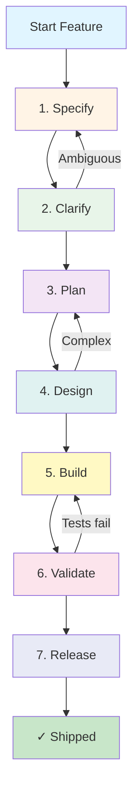

# Apex Workflow Architecture

This document explains the Apex workflow architecture and how phases interact in your project.

## Workflow Overview



## Phase Details

### Phase 1: Specify

**Purpose:** Define what needs to be built

**Input:**
- Feature description or ticket
- Business requirements
- User stories

**Process:**
1. Run `/apex:start "feature description"`
2. Run `/apex:specify` to create spec
3. AI generates `specs/{###-slug}/spec.md` with:
   - User stories
   - Acceptance criteria
   - Success metrics
   - Edge cases

**Output:**
- `specs/{###-slug}/spec.md`
- Updated `specs/INDEX.md`

**Artifacts:**
```
specs/
└── 001-feature-name/
    └── spec.md
```

---

### Phase 2: Clarify

**Purpose:** Resolve ambiguities and validate assumptions

**Input:**
- Spec from Phase 1
- Codebase context
- Architecture docs

**Process:**
1. Run `/apex:clarify`
2. AI identifies ambiguous requirements
3. Asks clarifying questions
4. Updates spec with clarifications

**Output:**
- Updated `spec.md` with Q&A section
- Resolved ambiguities
- Validated assumptions

**Feedback Loop:**
If critical ambiguities remain → return to Specify

---

### Phase 3: Plan

**Purpose:** Break down work into actionable tasks

**Input:**
- Clarified spec
- Current codebase structure
- Available patterns

**Process:**
1. Run `/apex:plan`
2. AI analyzes spec and codebase
3. Generates task breakdown with:
   - Task dependencies
   - Estimated complexity
   - Required files/components

**Output:**
- `specs/{###-slug}/plan.md` — Implementation strategy
- `specs/{###-slug}/tasks.md` — Task checklist

**Artifacts:**
```
specs/
└── 001-feature-name/
    ├── spec.md
    ├── plan.md
    └── tasks.md
```

---

### Phase 4: Design

**Purpose:** Create technical architecture and interfaces

**Input:**
- Plan from Phase 3
- Stack configuration (`.apex/stack.json`)
- Existing architecture (`ARCHITECTURE.md`)

**Process:**
1. Run `/apex:design`
2. AI designs:
   - Data models
   - API interfaces
   - Component structure
   - Database schema
3. Applies architecture patterns

**Output:**
- Updated `plan.md` with architectural decisions
- Data model definitions
- Interface specifications

**Feedback Loop:**
If design reveals complexity → return to Plan

---

### Phase 5: Build

**Purpose:** Implement features following TDD

**Input:**
- Design from Phase 4
- Task list from Phase 3
- Coding rules (`.apex/rules/`)

**Process:**
1. Run `/apex:implement` (or `/apex:auto` for full automation)
2. For each task in `tasks.md`:
   a. Write test (TDD)
   b. Implement code
   c. Run tests
   d. Commit with `/apex:commit`
   e. Mark task complete
3. Continue until all tasks done

**Output:**
- Implemented code
- Tests
- Git commits
- Updated `tasks.md`

**Hooks:**
- `pre-commit` validates code quality
- `post-commit` logs to audit trail

---

### Phase 6: Validate

**Purpose:** Verify implementation meets requirements

**Input:**
- Built code from Phase 5
- Original spec acceptance criteria
- Governance rules

**Process:**
1. Run `/apex:test` — Execute all tests
2. Run `/apex:review` — Code quality review
3. Run `/apex:validate` — Coverage & governance checks
4. Run `/apex:compliance` — Final compliance verification

**Output:**
- Test results
- Code review report
- Compliance report
- `specs/{###-slug}/review.md`

**Feedback Loop:**
If validation fails → return to Build with specific feedback

**Artifacts:**
```
specs/
└── 001-feature-name/
    ├── spec.md
    ├── plan.md
    ├── tasks.md
    └── review.md
```

---

### Phase 7: Release

**Purpose:** Prepare and ship the feature

**Input:**
- Validated code
- All passing tests
- Compliance approval

**Process:**
1. Run `/apex:ship`
2. AI prepares:
   - PR description
   - Release notes
   - Deployment checklist
3. Creates PR
4. Updates INDEX.md to "Implemented"

**Output:**
- Pull Request
- Release notes
- Deployment manifest

---

## Orchestration

### Automatic Mode

Use the orchestrator for fully automated workflow:

```bash
/apex:auto "Feature description"
```

The orchestrator:
1. Executes each phase sequentially
2. Pauses for checkpoints
3. Handles errors gracefully
4. Allows manual intervention
5. Resumes from last phase

### Manual Mode

Execute individual phases:

```bash
/apex:specify
/apex:clarify
/apex:plan
/apex:design
/apex:implement
/apex:test
/apex:ship
```

This gives you full control over each step.

## Workflow Override

### Skip Phases

Create `.apex/workflow/override.json`:

```json
{
  "skip_phases": ["clarify"],
  "reason": "Simple feature, no ambiguities"
}
```

### Custom Flow

Define your own phase sequence:

```json
{
  "custom_flow": [
    "specify",
    "plan",
    "implement",
    "test",
    "ship"
  ],
  "skip_phases": ["clarify", "design", "validate", "compliance"]
}
```

### Bypass Governance

For prototyping or experimentation:

```json
{
  "bypass_checks": true,
  "bypass_reason": "Spike/prototype only",
  "requires_approval": false
}
```

⚠️ **Warning:** Bypassing governance is not recommended for production code.

## Phase Status Tracking

All phase status is tracked in `specs/INDEX.md`:

```markdown
| ID | Feature | Status | Updated |
|----|---------|--------|---------|
| 001-auth | Add authentication | Designed | 2024-06-23 |
| 002-api | REST API endpoints | Validated | 2024-06-22 |
| 003-db | Database migration | Implemented | 2024-06-21 |
```

Status values:
- **Started** — Phase 1 begun
- **Specified** — Phase 1 complete
- **Clarified** — Phase 2 complete
- **Planned** — Phase 3 complete
- **Designed** — Phase 4 complete
- **Built** — Phase 5 complete
- **Validated** — Phase 6 complete
- **Implemented** — Phase 7 complete (shipped)

## Hooks & Automation

Hooks automatically enforce workflow rules:

| Hook | When | What It Does |
|------|------|--------------|
| `pre-specify` | Before spec creation | Validates feature description |
| `post-specify` | After spec creation | Updates INDEX.md |
| `pre-commit` | Before Git commit | Lints code, runs quick tests |
| `post-commit` | After Git commit | Logs to audit trail |
| `pre-push` | Before Git push | Runs full test suite |
| `pre-pr` | Before PR creation | Compliance checks |

To see all hooks:
```bash
node .apex/hooks/index.js --list
```

## Audit Trail

Every phase transition is logged to `.apex/audit/`:

```json
{
  "timestamp": "2024-06-23T10:30:00Z",
  "event": "phase_transition",
  "from": "Planned",
  "to": "Designed",
  "spec": "001-auth",
  "user": "developer",
  "automated": false
}
```

View audit trail:
```bash
/apex:audit
```

## Audit Trail

Every phase transition and operation is logged to `.apex/audit/`:

**Audit Log Format:**
```json
{"ts":"2024-06-23T10:30:00.000Z","action":"phase-change","spec":"001-auth","from":"Planned","to":"Designed"}
{"ts":"2024-06-23T10:45:00.000Z","action":"task-complete","spec":"001-auth","task":"T1-database"}
{"ts":"2024-06-23T11:00:00.000Z","action":"git-commit","spec":"001-auth","commit":"abc1234"}
```

**Query Audit Trail:**
```bash
# View all entries
/apex:audit

# Filter by spec
/apex:audit --by-spec 001-auth

# Filter by action
/apex:audit --by-action phase-change

# Export for analysis
/apex:audit --export csv > audit-trail.csv
```

## CLI Architecture

### Command Structure

```
apex/
├── cli.js                    # Main CLI entry point
├── commands/
│   ├── audit.js             # Audit log querying
│   ├── status.js            # Status display
│   ├── health.js            # Framework health checks
│   ├── logs.js              # Recent entries display
│   ├── graph.js             # Workflow visualization
│   ├── hooks.js             # Hook management
│   ├── agents.js            # Agent listing
│   ├── skills.js            # Skills listing
│   └── rules.js             # Rules listing
└── lib/
    ├── audit-reader.js      # Read/parse audit logs
    ├── formatter.js         # Output formatting (table, JSON, CSV)
    └── validator.js         # Input validation
```

### CLI Command Flow

```
User Command
    ↓
Parse Arguments
    ↓
Validate Input
    ↓
Load Configuration
    ↓
Execute Command
    ├─ Query Audit Logs
    ├─ Format Output
    └─ Display to User
    ↓
Log CLI Execution
    ↓
Exit (0=success, 1=error)
```

## Scripts Architecture

### Essential Scripts

```
.apex/scripts/
├── audit-log.js             # Audit logging system (core)
│   ├─ findProjectRoot()
│   ├─ getActiveSpec()
│   ├─ getAuditPath()
│   └─ logAuditEntry()
│
├── doctor.js                # Framework health checks
│   ├─ checkFrameworkStructure()
│   ├─ checkJsonFiles()
│   ├─ checkComponentCounts()
│   ├─ checkExecutableScripts()
│   └─ printSummary()
│
└── learn-codebase.js        # Codebase knowledge extraction
    ├─ analyzeStructure()
    ├─ extractPatterns()
    └─ generateSummary()
```

### Script Execution Flow

**Audit Logging System:**
```
Command Execution
    ↓
[Step 0] Log command
    ↓
audit-log.js findProjectRoot()
    ↓
audit-log.js getActiveSpec()
    ↓
audit-log.js getAuditPath()
    ↓
audit-log.js logAuditEntry()
    ↓
Append to .apex/audit/{date}.jsonl
    ↓
[Step 1+] Execute command
```

**Health Check System:**
```
/apex:health
    ↓
doctor.js starts
    ↓
Run 12 checks:
├─ Check .apex structure
├─ Validate profile.json
├─ Validate stack.json
├─ Check constitution.md
├─ Count commands (31)
├─ Count agents (22)
├─ Count skills (10+)
├─ Count rules (10)
├─ Count hooks (11)
├─ Verify scripts executable
├─ Test audit logging
└─ Verify IDE config
    ↓
Print results (with ANSI colors)
    ↓
Exit (0=all pass, 1=failures)
```

## Component Integration

### Data Flow Diagram

```
IDE/CLI Command
    ↓
    ├─→ Log: audit-log.js
    │      ↓
    │   .apex/audit/{date}.jsonl
    │
    ├─→ Execute: Workflow command
    │      ↓
    │   Spec files updated
    │   Phase transitions
    │   Tasks progress
    │
    ├─→ Query: apex audit/status/health
    │      ├─ Read: .apex/audit/*.jsonl
    │      ├─ Read: specs/INDEX.md
    │      ├─ Read: .apex/profile.json
    │      └─ Format & Display
    │
    └─→ Report: Audit trail / Status / Health
           ↓
        Developer sees current state
```

### Artifact Relationships

```
specs/INDEX.md (master status)
    ├─ Lists all specs (001, 002, 003, ...)
    ├─ Shows current phase for each
    └─ Updated by all phase commands

.apex/audit/{date}.jsonl (immutable trail)
    ├─ Logs phase transitions
    ├─ Logs file writes
    ├─ Logs task completions
    └─ Logs git commits

specs/{###-slug}/ (feature workspace)
    ├─ spec.md (requirements)
    ├─ plan.md (strategy)
    ├─ tasks.md (implementation tasks)
    ├─ review.md (validation results)
    └─ checklist.md (acceptance criteria)

.apex/profile.json (installation state)
    ├─ Component inventory (31 commands, 22 agents, etc.)
    ├─ Stack configuration
    ├─ Governance profile (enterprise-standard, etc.)
    └─ IDE preferences
```

## Integration Points

### IDE Integration

Commands are published to:
- `.cursor/prompts/` — Cursor IDE
- `.github/prompts/` — GitHub Copilot
- `.claude/commands/` — Claude

### CI/CD Integration

Apex can integrate with CI/CD:

```yaml
# .github/workflows/apex-validate.yml
name: Apex Validation
on: [pull_request]
jobs:
  validate:
    runs-on: ubuntu-latest
    steps:
      - uses: actions/checkout@v2
      - name: Run Apex validation
        run: |
          node .apex/hooks/pre-pr.js
```

### Git Hooks

Apex installs Git hooks automatically:

```bash
.git/hooks/
├── pre-commit → .apex/hooks/pre-commit.js
├── post-commit → .apex/hooks/post-commit.js
└── pre-push → .apex/hooks/pre-push.js
```

## Customization

### Add Custom Rules

Create `.apex/rules/custom/my-rule.md`:

```markdown
# My Custom Rule

## When
During implementation

## Check
All functions must have JSDoc comments

## Fix
Add JSDoc to function
```

### Add Custom Skills

Create `.apex/skills/custom-skill.md`:

```markdown
# Custom Skill

## Capability
Specialized domain knowledge

## Usage
Loaded automatically when working with {domain}
```

### Add Custom Agents

Create `.apex/agents/custom-agent.md`:

```markdown
# Custom Agent

## Role
Specialized task executor

## Responsibilities
- Specific task automation
- Custom validation
```

## Troubleshooting

### Workflow Stuck

Check current status:
```bash
/apex:status
```

Force phase transition:
```bash
# Edit specs/INDEX.md directly
| 001 | Feature | Designed | 2024-06-23 |
#                ^^^^^^^^ Change this
```

### Phase Fails

View error details in `.apex/audit/` logs.

Retry phase:
```bash
/apex:{phase-name}
```

### Override Not Working

Verify `.apex/workflow/override.json` syntax:
```bash
cat .apex/workflow/override.json | jq .
```

## Best Practices

1. **Use orchestrator for new features**
   - Run `/apex:auto` for complete automation
   - Let AI handle phase transitions

2. **Manual mode for learning**
   - Run individual commands to understand each phase
   - Good for onboarding new team members

3. **Override judiciously**
   - Only skip phases for good reason
   - Document why in override.json

4. **Review audit trail regularly**
   - Check `.apex/audit/` for insights
   - Identify bottlenecks in workflow

5. **Customize for your team**
   - Adapt rules, skills, agents to your needs
   - Share customizations via profile export

---

For more details on each phase, see `.apex/workflow/phases/`.
